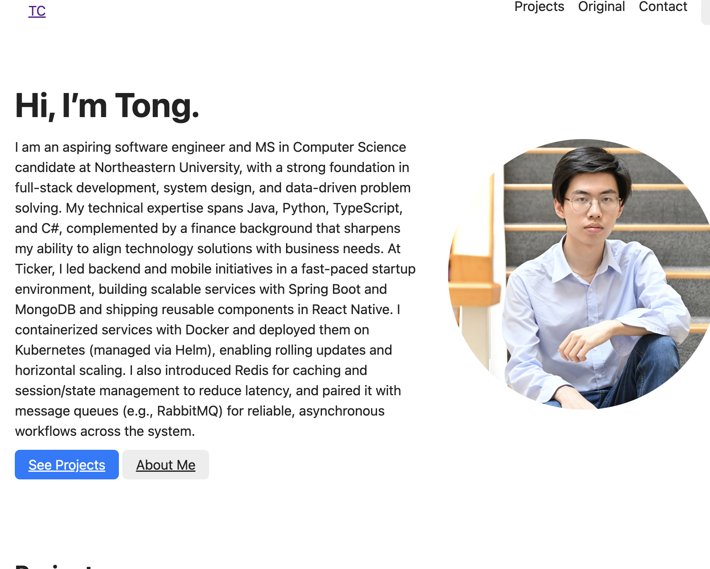

# Tong Cai — Personal Homepage

## Author

- **Name**: Tong Cai
- **Email**: cai.to@northeastern.edu

## Class Link

- Course: [CS5610 — Web Development Fundamentals](https://johnguerra.co/classes/webDevelopment_spring_2025/)  


## Project Objective

The objective of this project is to build a personal homepage using **vanilla HTML5, CSS3, and ES6+ modules**.  
The page introduces myself, highlights selected projects, and provides contact information.  
It also demonstrates good coding practices, accessibility, responsive design, and includes a creative “honeycomb gallery” component that differentiates it from other homepages.

## Screenshot



## Introduction demo
[Slides](https://docs.google.com/presentation/d/1ZpArRNoZ8-75VvdyHZtsqScBrhjaVmNOKXIN5InYAf0/edit?usp=sharing)

## Instructions to Build / Run

1. Clone or download this repository.
2. Run a local server:
     ```bash
     npm install
     npm start
     ```
     Then open `http://localhost:8000/` in your browser.
   - Or, if using VS Code, install the **Live Server** extension and right-click `index.html` → **Open with Live Server**.
3. Navigate through `index.html` and `contact.html` to explore the full site.

## GenAI

Use of GenAI

I used OpenAI GPT-5 (September 2025 version) as a writing assistant while preparing this project. Specifically:

Improving README clarity: I drafted the README myself, and then used ChatGPT to help rephrase some sentences so they were more concise, professional, and easier to understand.

## License

## This project is licensed under the [MIT License](./LICENSE).
